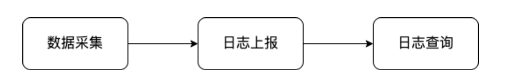
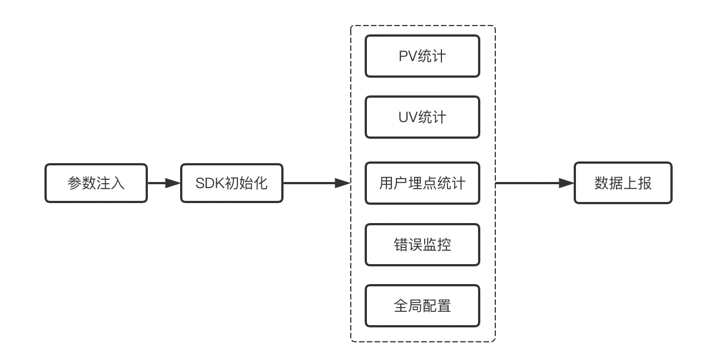

### 前端监控

#### 背景

思考一下，我们的项目代码在上线之后是不是就不用管了呢？并不是，作为前端开发工程师，我们是直接跟用户打交道的，一个应用的用户留存率跟这个应用的稳定性有很大的关系，因为监控能让我们快速的发现并解决问题，所以一个系统的监控体系越完善这个系统就越稳定。所以不光后端要对接口做监控，前端的监控也显得很重要。

对于我们来说，学习如何做前端的监控一方面可以拓宽我们的知识面，另一方面可以在面试的时候加分，让面试官觉得我们不只是在公司整天的写业务代码，也有技术上的产出，不至于面试的时候问到这方面的问题完全摸不着头脑。

#### 怎么做？

- 接入现成的

  1. sentry  https://docs.sentry.io/

  2. fundebug  https://www.fundebug.com/
- 自己封装

#### 需要监控什么？

- 错误统计

  首先，我们的代码发布到线上总是会发生奇奇怪怪的错误，错误原因也五花八门，可能是浏览器兼容问题，可能是代码里面没做兜底，也可能是后端接口挂掉了等等错误，可能随便一个错误都会影响用户的使用，所以对线上进行错误监控显的尤为重要，能够让我们第一时间去响应报错并解决。

- 行为日志埋点

  对于一些常见的电商app，比如淘宝，都有一套自己的用户行为分析的系统，分析用户浏览时间比较长的页面有哪些，常点击的按钮有哪些等等行为，通过分析用户的这些行为去制定不同的策略引导你购物，这些都可以通过前端埋点去实现对用户行为的监控。

- PV/UV统计

  我们上线那么多的前端页面，肯定特别想知道我们的用户对哪个页面的访问次数比较多，也想知道每天有多少的用户访问我们的系统，这就需要用到PV,UV的统计

所以我们系统的设计就主要围绕上面着三点进行设计，主要流程如下：



数据采集：数据采集做的就是采集我们系统的监控数据，包括PV,UV和用户行为及前端报错的数据。

日志上报：上报做的就是将第一步采集到的数据发送到服务端。

日志查询：这一步就是在后台查询我们采集并上报的数据，方便对系统进行分析。

我们的SDK做的主要是对前两部分的实现。

#### 功能拆分



#### 环境

- Mac 
- Node 16.14.2
- npm 8.5.0

#### 初始化

初始化其实很简单，就是获取用户传过来的参数，然后调用我们的初始化函数就可以了，在初始化函数中，我们可以注入一些监听事件来实现数据统计的功能。

```javascript
// 1.加载配置 2.监控代码注入
function init(options) {
  loadConfig(options); // 加载配置
}
```

#### 错误监控

> 前端是直接和用户打交道的，前端页面报错是很影响用户体验一件事，即使在测试充分后上线也会因为用户的操作行为以及操作的环境出现各种各样的错误，所以，不光是后端需要加报警监控，前端的错误监控也很重要。

##### 错误类型

1. 语法错误

   语法错误一般在可发阶段就可以发现，比如常见的单词拼写错误，中英文符号错误等。注意：语法错误是无法被try catch捕获的，因为在开发阶段就能发现，所以一般不会发布到线上环境。

   ```javascript
   try {
     let name = 'heima; // 少一个单引号
     console.log(name);
   } catch (error) {
     console.log('----捕获到了语法错误-----');
   }
   ```

2. 同步错误

   同步错误指的是在js同步执行过程中的错误，比如变量未定义，是可以被try catch给捕获到的

   ```javascript
   try {
     const name = 'heima';
     console.log(nam);
   } catch (error) {
     console.log('------同步错误-------')
   }
   ```

3. 异步错误

   异步错误指的是在setTimeout等函数中发生的错误，是无法被try catch捕获到的

   ```javascript
   try {
     setTimeout(() => {
       undefined.map();
     }, 0);
   } catch (error) {
     console.log('-----异步错误-----')
   }
   ```

   异步错误的话我们可以用window.onerror来进行处理，这个方法比try catch要强大很多

   ```javascript
   /**
    * @param {String}  msg    错误描述
    * @param {String}  url    报错文件
    * @param {Number}  row    行号
    * @param {Number}  col    列号
    * @param {Object}  error  错误Error对象
    */
    window.onerror = function (msg, url, row, col, error) {
      console.log('出错了！！！');
      console.log(msg);
      console.log(url);
      console.log(row);
      console.log(col);
      console.log(error);
   };
   ```

4. promise错误

   在 `promise` 中使用 `catch` 可以捕获到异步的错误，但是如果没有写 `catch` 去捕获错误的话 `window.onerror` 也捕获不到的，所以写 `promise` 的时候最好要写上 `catch` ，或者可以在全局加上 `unhandledrejection` 的监听，用来监听没有被捕获的promise错误。

   ```javascript
   window.addEventListener("unhandledrejection", function(error){
     console.log('捕获到异常：', error);
   }, true);
   ```

5. 资源加载错误

   资源加载错误指的是比如一些资源文件获取失败，可能是服务器挂掉了等原因造成的，出现这种情况就比较严重了，所以需要能够及时的处理，网路错误一般用 ` window.addEventListener ` 来捕获。

   ```javascript
   window.addEventListener('error', (error) => {
     console.log(error);
   }, true);
   ```

> 所以SDK错误监控的实现，就是围绕这几种错误实现的。 `try-catch` 用来在可预见情况下监控特定的错误，`window.onerror` 主要是来捕获预料之外的错误，比如异步错误。但是 `window.onerror` 也并不是万能的，它可以捕获语法，同步，异步的错误，但是对于promise错误以及网络错误还是无能为力，所以还需要 `unhandledrejection` 监听来捕获promise错误，最后，再加上 `error` 监听捕获资源加载的错误就能将各种类型的错误全覆盖了。

#### 用户埋点统计

> 埋点是监控用户在我们应用上的一些动作表现，是不是经常感觉有些应用推荐的内容都是自己感兴趣的，这就是埋点这个“内鬼”在搞怪，比如你在淘宝上的某类型的鞋子的页面浏览了几分钟，那么就会有一个“张三在2022-7-16 15:30搜索了某款运动鞋并浏览了十分钟”的记录的上报，后台就可以根据这些上报的数据去分析用户的行为，并且制定之后推送或者产品的迭代优化等，对于产品后续的发展起着重要作用。埋点又分为手动埋点和无痕埋点。

##### 手动埋点

> 手动埋点就是手动的在代码里面添加相关的埋点代码，比如用户点击某个按钮，就在这个按钮的点击事件中加入相关的埋点代码，或者提交了一个表单，就在这个提交事件中加入埋点代码。

```javascript
// 方式1
<button
  onClick={() => {
    // 业务代码
  	tracker('click', '用户去支付');
    // tracker('visit', '访问新页面');
    // tracker('submit', '提交表单');
  }}
>手动埋点</button>
```

```javascript
// 方式2
<button 
	data-target="支付按钮"
	onClick={() => {
    // 业务代码
  }}
>手动上报</button>
```

- 优点：可控性强，可以自定义上报具体的数据。
- 缺点：对业务代码侵入性强，如果有很多地方需要埋点就得一个一个手动的去添加埋点代码。

##### 无痕埋点

> 无痕埋点是为了解决手动埋点的缺点，实现一种不用侵入业务代码就能在应用中添加埋点监控的埋点方式。

```javascript
<button onClick={() => {
  // 业务代码
}}>自动埋点</button>
```

```javascript
// 自动埋点实现
function autoTracker () {
  // 添加全局click监听
  document.body.addEventListener('click', function (e) {
    const clickedDom = e.target;
    // 获取data-target属性值
    let target = clickedDom?.getAttribute('data-target');
    if (target) {
      // 如果设置data-target属性就上报对应的值--手动埋点
      tracker('click', target);
    } else {
      // 如果没有设置data-target属性就上报被点击元素的html路径
      const path = getPathTo(clickedDom);
      tracker('click', path);
    }
  }, false);
};
```


- 优点：不用侵入务代码就能实现全局的埋点。
- 缺点：只能上报基本的行为交互信息，无法上报自定义的数据；上报次数多，服务器性能压力大。

#### PV统计

> PV即页面浏览量，用来表示该页面的访问数量

在SPA应用之前只需要监听 `onload` 事件即可统计页面的PV，在SPA应用中，页面路由的切换完全由前端实现，主流的react和vue框架都有自己的路由管理库，而单页路由又区分为 `hash` 路由和 `history` 路由，两种路由的原理又不一样，所以统计起来会有点复杂。我们这里将分别针对两种路由来实现不同的采集数据的方式。

##### history路由

history路由依赖全局对象 `history` 实现的

- history.back(); // 返回上一页，和浏览器回退功能一样
- history.forward(); // 前进一页，和浏览器前进功能一样
- history.go(); // 跳转到历史记录中的某一页, eg:  history.go(-1); history.go(1)
- history.pushState(); // 添加新的历史记录
- history.replaceState(); // 修改当前的记录项

history路由的实现主要依赖的就是 `pushState` 和 `replaceState` 来实现的，但是这两种方法不能被 `popstate` 监听到，所以需要对这两种方法进行重写来实现数据的采集。

```javascript
/**
 * 重写pushState和replaceState方法
 * @param {*} name 
 * @returns 
 */
const createHistoryEvent = function (name) {
  // 拿到原来的处理方法
  const origin = window.history[name];
  return function(event) {
    if (name === 'replaceState') {
      const { current } = event;
      const pathName = location.pathname;
      if (current === pathName) {
        let res = origin.apply(this, arguments);
        return res;
      }
    }

    let res = origin.apply(this, arguments);
    let e = new Event(name);
    e.arguments = arguments;
    window.dispatchEvent(e);
    return res;
  };
};

window.history.pushState = createHistoryEvent('pushState');
window.history.replaceState = createHistoryEvent('replaceState');

function listener() {
  const stayTime = getStayTime(); // 停留时间
  const currentPage = window.location.href; // 页面路径
  lazyReport('visit', {
    stayTime,
    page: beforePage,
  })
  beforePage = currentPage;
}

// history.go()、history.back()、history.forward() 监听
window.addEventListener('popstate', function () {
  listener()
});

// history.pushState
window.addEventListener('pushState', function () {
  listener()
});

// history.replaceState
window.addEventListener('replaceState', function () {
  listener()
});
```

##### hash路由

url上hash的改变会出发 `hashchange` 的监听，所以我们只需要在全局加上一个监听函数，在监听函数中实现采集并上报就可以了。但是在react和vue中，对于hash路由的跳转并不是通过 `hashchange` 的监听实现的，而是通过 `pushState` 实现，所以，还需要加上对 `pushState` 的监听才可以。 

```javascript
export function hashPageTrackerReport() {
  let beforeTime = Date.now(); // 进入页面的时间
  let beforePage = ''; // 上一个页面
  
  // 上报
  function listener() {
    const stayTime = getStayTime();
    const currentPage = window.location.href;
      lazyReport('visit', {
      stayTime,
      page: beforePage,
    })
    beforePage = currentPage;
  }

  // hash路由监听
  window.addEventListener('hashchange', function () {
    listener()
  });
}
```

#### UV统计

> UV统计的是一天内访问该网站的用户数

uv统计比较简单，就只需要在SDK初始化的时候上报一条消息就可以了

```javascript
/**
 * 初始化配置
 * @param {*} options 
 */
function init(options) {
  ... // 加载配置
  report('user', '加载应用'); // uv统计
}
```

#### 数据上报

1. xhr接口请求

   采用接口请求的方式是最简单的，就跟请求其他业务接口一样，只不过上传的是埋点的数据。但是在通常的情况下，一般在公司里面处理埋点的服务器和处理业务逻辑的处理器不是同一台，所以还需要手动解决跨域的问题，另一方面，如果在上报的过程中刷新或者重新打开新页面，可能会造成埋点数据的缺失，所以传统的xhr接口请求的方式并不能很好的适应埋点的需求。

2. img标签

   img标签的方式是通过将埋点数据伪装成图片URL的请求方式，这样就避免了跨域的问题，但是因为浏览器对url的长度会有限制，所以通过这种方式上报不适合大数据量上报的场景，而且也会存在刷新或者打开页面的时候上报的数据丢失的情况。

3. sendBeacon

   鉴于以上两种方式的缺点，sendBeacon应运而生了，sendBeacon可以说是为埋点量身定做的，这种方式不会有跨域的限制，也不会存在因为刷新页面等情况造成数据丢失的情况，唯一的缺点就是在某些浏览器上存在兼容性的问题，所以在日常的开发场景中，通常采用sendBeacon上报和img标签上报结合的方式

```javascript
 * 上报
 * @param {*} type 
 * @param {*} params 
 */
export function report(type, params) {
  const appId = window['_monitor_app_id_'];
  const userId = window['_monitor_user_id_'];
  const url = window['_monitor_report_url_'];

  const logParams = {
    appId, // 项目的appId
    userId,
    type, // error/action/visit/user
    data: params, // 上报的数据
    currentTime: new Date().getTime(), // 时间戳
    currentPage: window.location.href, // 当前页面
    ua: navigator.userAgent, // ua信息
  };

  let logParamsString = JSON.stringify(logParams);

  if (navigator.sendBeacon) { // 支持sendBeacon的浏览器
    navigator.sendBeacon(url, logParamsString);
  } else { // 不支持sendBeacon的浏览器
    let oImage = new Image();
    oImage.src = `${url}?logs=${logParamsString}`;
  }
}
```

##### 合并上报

对于无痕埋点来说，一次点击就进行一次上报对服务器来说压力有点大，所以最好是能进行一个合并上报。

```javascript
// cache.js
const cache = [];

export function getCache() {
  return cache;
}

export function addCache(data) {
  cache.push(data);
}

// lazyReport.js
export function lazyReport(type, params) {
  // ....
  const data = getCache();

  if (delay === 0) { // delay=0相当于不做延迟上报
    report(data);
    return;
  }

  if (data.length > 10) { // 数据达到10条上报
    report(data);
    clearTimeout(timer);
    return;
  }

  clearTimeout(timer);
  timer = setTimeout(() => { // 合并上报
    report(data);
  }, delay);
}

```


